# Hyperparameters tuning

> Don’t spend too much time tuning hyperparameters， Only if you don’t have any more ideas or you have spare computational resources

## General pipeline

1. Select the most influential parameters
- There are tons of parameters and we can’t tune all of them
2. Understand, how exactly they influence the training
- A parameter in red
    – Increase it to underfitting
    – Increasing it impedes fitting
    – Decrease to allow model fit easier
- A parameter in green
    - Increasing it leads to a better fit(overfit) on trainset
    - Increase it,if model underfits
    - Decreaseifoverfits
3. Tune them!
- Manually (change and examine)
- Automatically(hyperopt,etc.)
    – Hyperopt
    – Scikit-optimize 
    – Spearmint
    – GPyOpt
    – RoBO
    – SMAC3

## Tree based model

### GBDT

|XGBoost|LightGBM|
|:--|:--|
| <font color="blue">max_depth</font> |  <font color="blue">max_depth/num_leaves</font>  |
| <font color="blue">subsample</font>  |  <font color="blue">bagging_fraction</font>  |
| <font color="blue">colsample_bytree<font>/<font color="blue">colsample_bylevel</font>  | <font color="blue">feature_fraction</font>   |
| <font color="red">min_child_weight </font> |  <font color="red">min_data_in_leaf</font>  |
| <font color="red">lambda, alpha</font>  |  <font color="red">lambda, alpha</font>  |
| <font color="blue"> eta </font> |  <font color="red">learning_rate</font>  |
| <font color="blue">num_round</font>  | <font color="blue">num_iterations</font>   |
| seed  | seed  |


### RandomForest/ExtraTrees
- <font color="yellow">N_estimators (the higher the better)</font>
- <font color="blue">cmax_depth</font>
- <font color="blue">cmax_features</font>
- <font color="red">cmin_samples_leaf</font>
- criterion ('gini' is better in most of time)
- random_state
- n_jobs


### Neural Nets
- <font color="blue">Number of neurons per layer</font>
- <font color="blue">Number of layers</font>
- Optimizers
    – <font color="red">SGD + momentum</font>
    – <font color="blue">Adam/Adadelta/Adagrad/...</font>
        - In practice lead to more overfitting
- <font color="blue">Batch size</font>
- Learning rate (not too high or not too low, depend on other parameters)
- Regularization
    – <font color="blue">L2/L1 for weights</font>
    – <font color="blue">Dropout/Dropconnect</font>
    – <font color="blue">Static dropconnect</font>

### Linear Model
<font color="red">Regularization parameter (C, alpha, lambda, ...)</font>
– Start with very small value and increase it.
– SVC starts to work slower as C increases

Regularization type
– L1/L2/L1+L2 -- try each
– L1 can be used for feature selection


# Practical Guide for competition

## Define your goals. 
What you can get out of your participation?
1. To learn more about an interesting problem
2. To get acquainted with new software tools
3. To hunt for a medal

## Working with ideas
1. Organize ideas in some structure
2. Select the most important and promising ideas
3. Try to understand the reasons why something does/doesn’t work

### Initial pipeline
1. Get familiar with problem domain
2. Start with simple (or even primitive) solution
3. Debug full pipeline
− From reading data to writing submission file
4. “From simple to complex”
− I prefer to start with Random Forest rather than Gradient Boosted Decision Trees

### data loading
1. Do basic preprocessing and convert csv/txt files into hdf5/npy for much faster loading
2. Do not forget that by default data is stored in 64-bit arrays, most of the times you can safely downcast it to 32-bits
3. Large datasets can be processed in chunks

### Performance evaluation
1. Extensive validation is not always needed
2. Start with fastest models - such as LightGBM

## Everything is a hyperparameter
Sort all parameters by these principles: 
1. Importance
2. Feasibility
3. Understanding

Note: changing one parameter can affect the whole pipeline

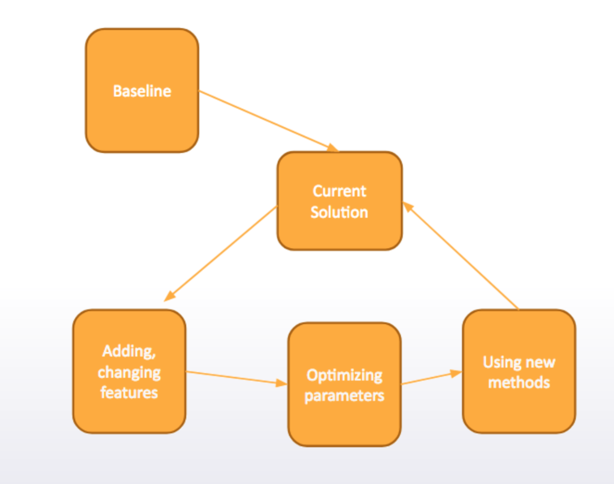


## tricks
1. Fast and dirty always better
- Don’t pay too much attention to code quality
- Keep things simple: save only important things
- If you feel uncomfortable with given computational resources - rent a larger server
2. Use good variable names
- If your code is hard to read — you definitely will have
problems soon or later
3. Keep your research reproducible
- Fix random seed
− Write down exactly how any features were generated
− Use Version Control Systems (VCS, for example, git)
4. Reuse code
− Especially important to use same code for train and test stages
5. Read papers
- For example, how to optimize AUC
6. Read forums and examine kernels first
7. Code organization
- keeping it clean
- macros
- test/val

## Pipeline detail

|Procedure| days|
|:--|:--|
|Understand the problem| 1 ~ 2 days|
|Exploratory data analysis | 1 ~ 2 days|
|Define cv strategy| 1 day|
|Feature Engineering| until last 3 ~ 4 days|
|Modeling| Until last 3 ~ 4 days|
|Ensembling| last 3 ~ 4 days|


### Understand broadly the problem
1. type of problem
2. How big is the dataset
3. What is the metric
4. Previous code revelant
6. Hardware needed (cpu, gpu ....)
7. Software needed (TF, Sklearn, xgboost, lightgBM)


### EDA
see the blog [Exploratory data analysis](https://zhangruochi.com/Exploratory-data-analysis/2019/07/13/)

### Define cv strategy
1. This setp is critical
2. Is time is important? **Time-based validation**
3. Different entities than the train. **StratifiedKFold Validation**
4. Is it completely random? Random validation
5. Combination of all the above
6. Use the leader board to test

### Feature Engineering
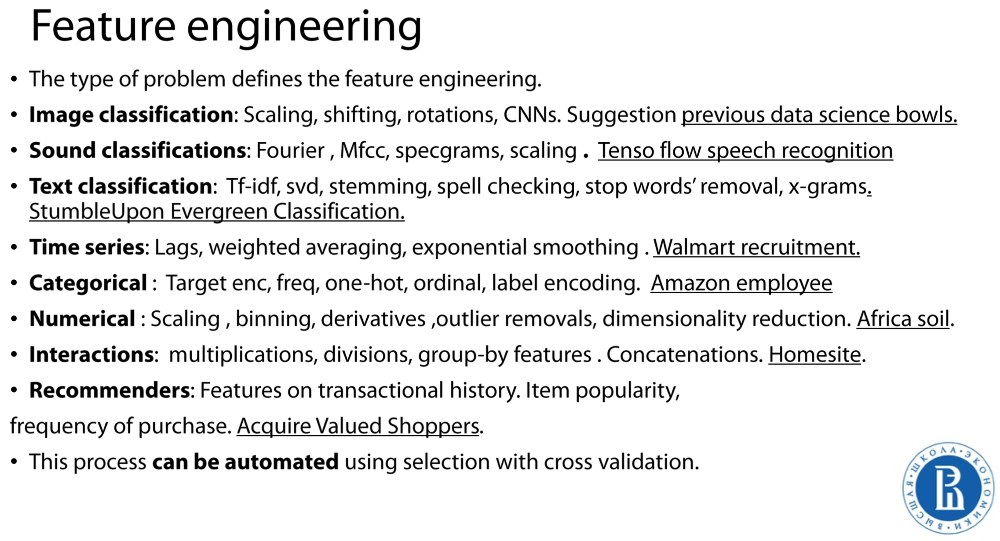

### Modeling 
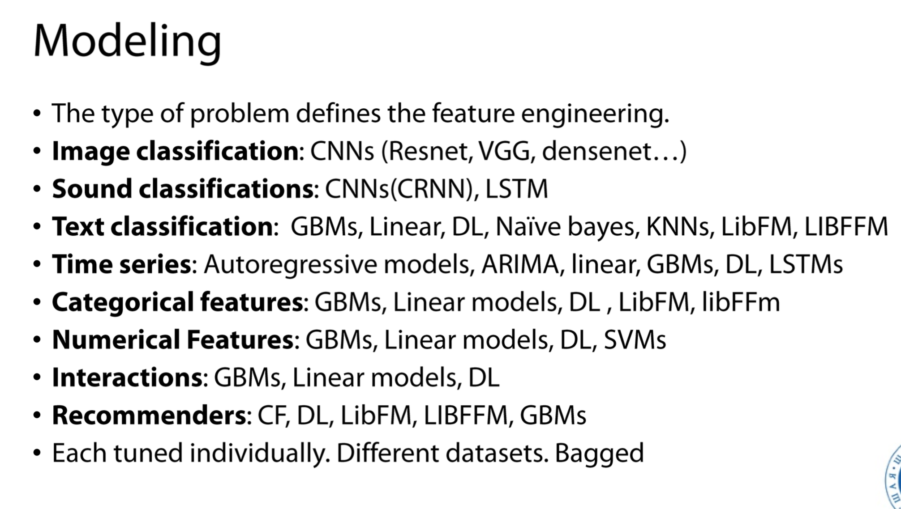


### Ensembling
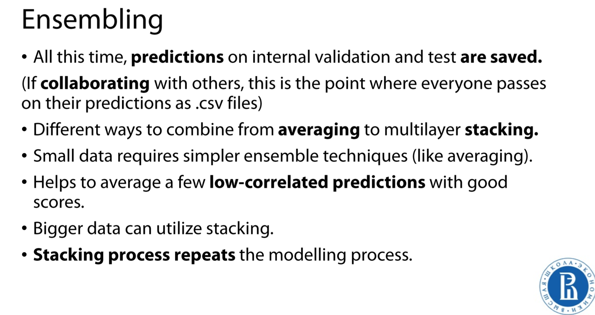


# Advanced Features

## Statistics and distance based features

### Groupby feature

```python
gb = df.groupby(['user_id','page_id'], as_index = False).agg({'ad_price': {'max_price': np.max, 'min_price': np.min}})
gb.columns = ['user_id','page_id','min_price','max_price']
```
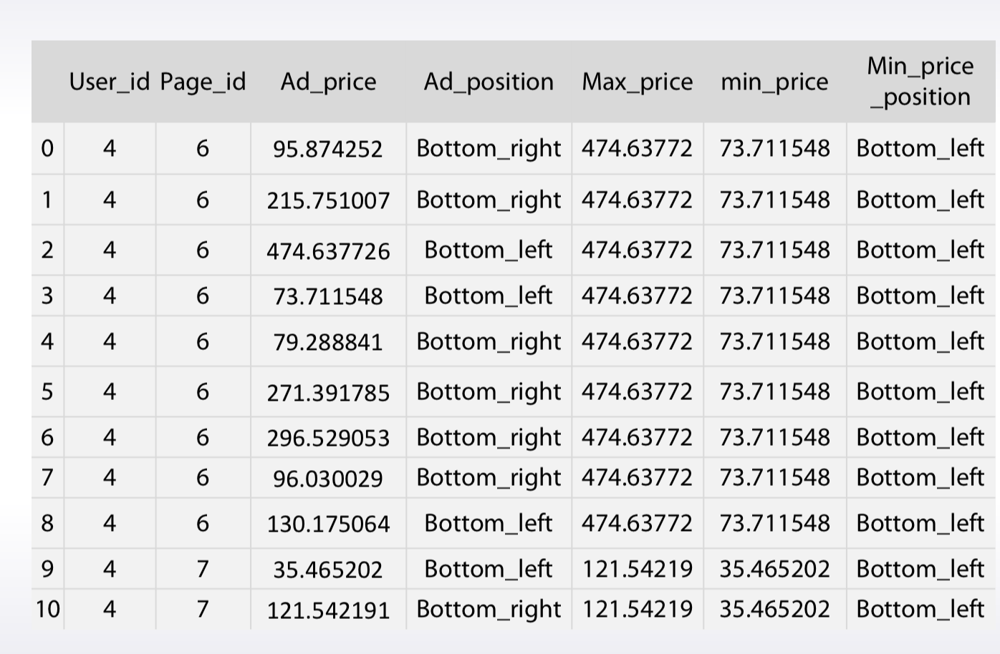

- How many pages user visited
- Standard deviation of prices
- Most visited page
- Many, many more

### Neighbors
- Explicit group is not needed
- More flexible
- Much harder to implement

such as:

- Number of houses in 500m, 1000m,..
- Average price per square meter in 500m, 1000m,..
- Number of schools/supermarkets/parking lots in 500m, 1000m,..
- Distance to closest subway station

KNN features as example:
- Mean encode all the variables
- For every point, find 2000 nearest neighbors using Bray-Curtis metric
$$\frac{\sum|\mu_i - \upsilon_i|}{|\mu_i + \upsilon_i|}$$
- Calculate various features from those 2000 neighbors
    - Mean target of nearest 5,10,15,500, 2000 neighbors
    - Mean distance to 10 closest neighbors
    - Mean distance to 10 closest neighbors with target 1
    - Mean distance to 10 closest neighbors with target 0

## Matrix Factorizations for Feature Extraction

- Matrix Factorization is a very general approach for dimensionality reduction and feature extraction
- It can be applied for transforming categorical features into real-valued
- Many of tricks trick suitable for linear models can be useful for MF

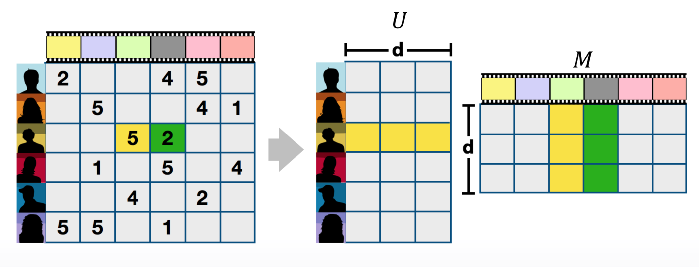
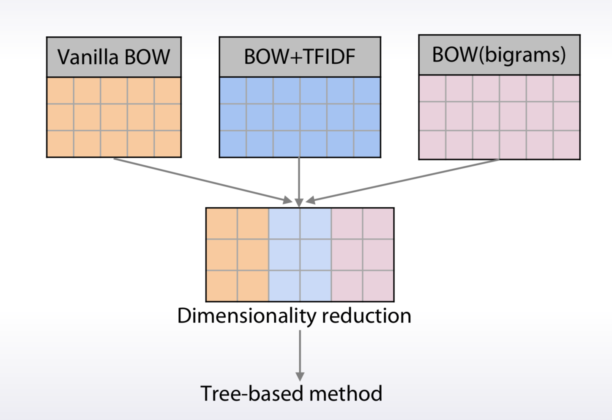

- Can be apply only for some columns
- Can provide additional diversity
    − Good for ensembles
- It is a lossy transformation. Its’ efficiency depends on:
    − Particulartask
    − Numberoflatentfactors(Usually 5-100)
- Several MF methods you can find in sklearn
- SVD and PCA
    − Standart tools for Matrix Factorization
- TruncatedSVD
    − Works with sparse matrices
- Non-negative Matrix Factorization (NMF)
    − Ensures that all latent factors are non-negative 
    − Good for counts-like data

## Feature interactions
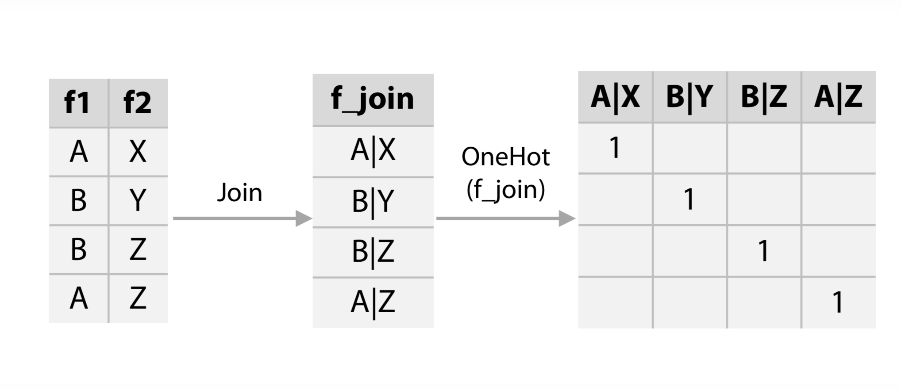
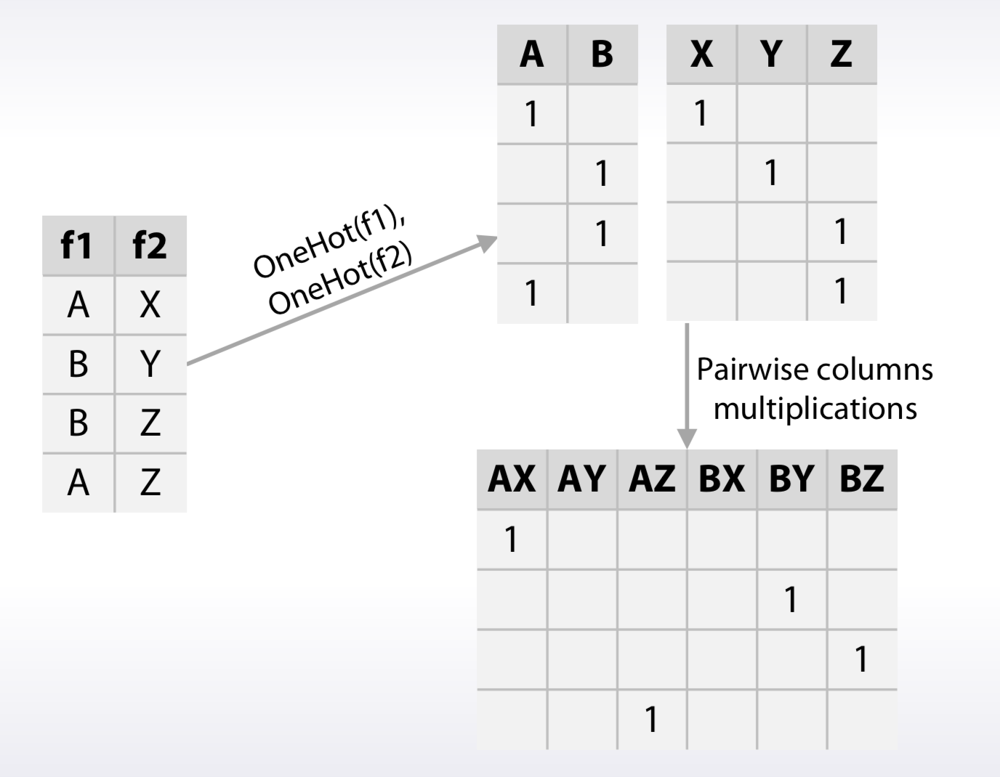


- We have a lot of possible interactions − N\*N for N features
    - Even more if use several types in interactions
- Need to reduce its’ number
    - Dimensionality reduction
    - Feature selection
- Interactions' order
    - We looked at 2nd and higher order interactions.
    - It is hard to do generation and selection automatically.
    - Manual building of high-order interactions is some kind of art.


### Frequent operations for feature interaction
- Multiplication
- Sum
- Diff
- Division

### Example of interaction generation pipeline
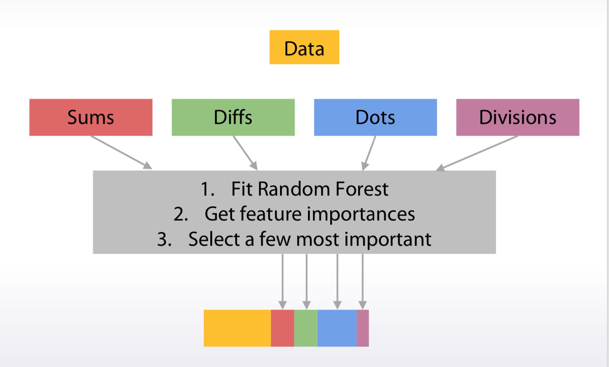


### Extract features from DT

get the index of the leaf that each sample is predicted as. it a method to get the high order features

```python
tree.apply()
```

## tSNE

- Result heavily depends on hyperparameters (perplexity)
- Good practice is to use several projections with different perplexities (5-100)
- Due to stochastic nature, tSNE provides different projections even for the same data\hyperparams
    − Train and test should be projected together
- tSNE runs for a long time with a big number of features
    − it is common to do dimensionality reduction before projection.


# Ensemble methods

> Ensemble methods means combining different machine learning models to get a better prediction


## Averageing (or blending)

$$(model_1 + model_2)/2$$

## Weighted averaging

$$model_1 * 0.3 + model_2 * 0.7$$

## Conditional averaging

$$model_1 \, if \, x < 50 \, else \, model_2 $$

## Bagging

### What is bagging
Bagging means **averaging** slightly different versions of the **same model** to improve accuracy

### Why bagging
There are 2 main sources of errors in modeling:
- Bias (underfitting)
- Variance (overfitting)
Bagging try to reduce the variance

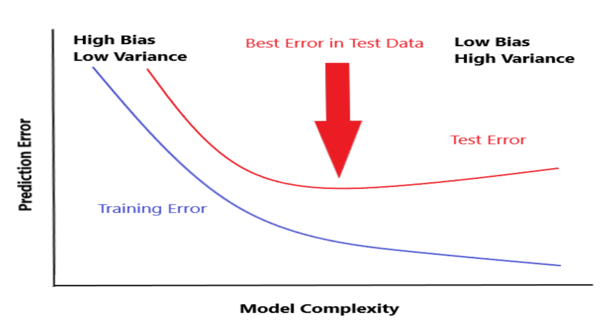

### Parameterss that control bagging
- Changing the seed
- Row sampling or bootstraping
- Shuffling
- Column sampling
- Model-specific parameters
- Number of models
- Parallelism

```python
model = RandomForestRegressor()
bags = 10
seed = 1
bagged_prediction = np.zeros(test.shape[0])
for n in range(0,bags):
    model.set_params(randm_state = seed + n)
    model.fit(train,y)
    preds = model.predict(test)
    bagged_prediction += preds

bagged_prediction /= bags
```


## Boosting

### What is Boosting
A form of weighted averaging of models where each model is built sequentially via taking into account the past model performance

### Main boosting types
1. Weight based
2. Residual based

#### Weighted based
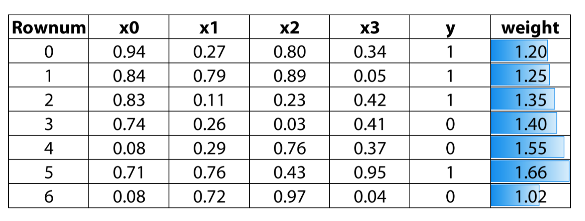

#### Weighted based boosting parameters
- Learning rate
- Number of estimators
- Input model - can be anything that accepts weights
- Sub boosting type:
    - AdaBoost
    - LogitBoost

#### Residual based boosting
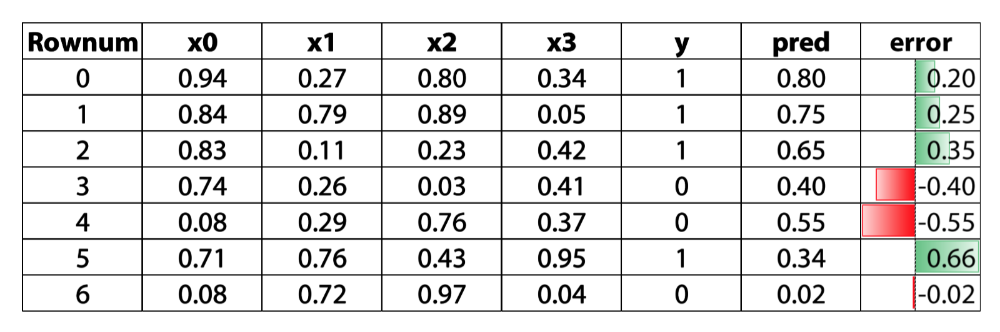
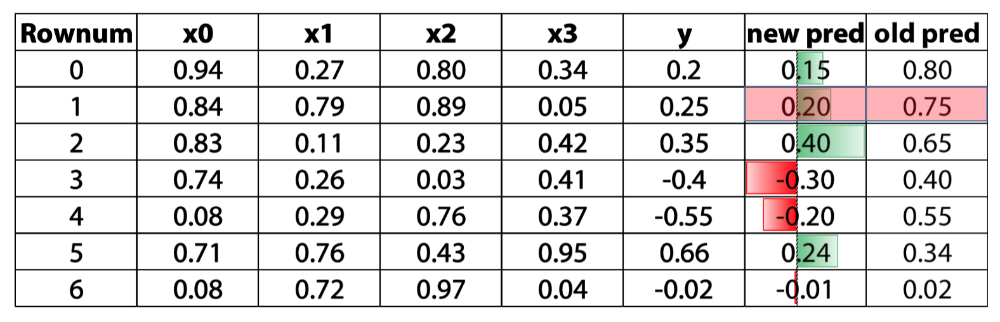

we use the error to get the **direction**, and update our prediction through that direction

### Residual based boosting parameters
- Learning rate
- Number of estimators
- Row sampling
- Column (sub) sampling
- Input model - better be trees
- Sub boosting type:
    - Fully gradient based
    - Dart
- Implementation 
    - XGBoost
    - LightGBM
    - H2O's GBM
    - Catboost
    - Sklearn's GBM
    
## Stacking
### What is stacking?
Stacking means making prediction of a number of models in a hold-out set and than using a different(Meta) model to train on these prediction

### Methology
1. Split the train set into two disjoint sets (train and dev)
2. Train several base learners on the first part
3. Make predictions with the base learners on the dev set and test set
4. using the predictions of dev set to train a meta model and make predictions on test set

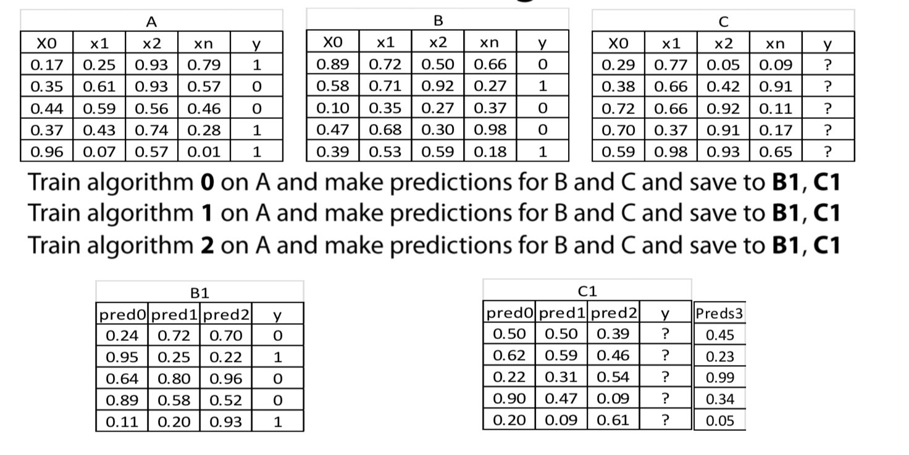

```python
train,dev,y_train,y_dev = train_test_split(train,y_train, test_size = 0.2)
model1 = RandomForestRegressor()
model2 = LinearRegression()

model1.fit(train,y_train)
model2.fit(train,y_train)

pred1 = model1.predict(dev)
pred2 = model2.predict(dev)

test_pred1 = model1.predict(test)
test_pred2 = model2.predict(test)

stacked_predcitions = np.column_stack((pred1,pred2))
stacked_test_predcitions = np.column_stack((test_pred1,test_pred2))

meta_model = LinearRegression()
meta_model.fit(stacked_predcitions,y_dev)

final_predictions = meta_model.predict(stacked_test_predcitions)
```

### Things to be mindful of
- With time  sensitive data - respect time
- Diversity as important as performance(different model you choose need bring new information, no matter how weak the model is)
- Diversity

## StackNet
A scalable meta modelling methology taht utilizes stacking to combine multiple models in a neural network architecture of multiple levels

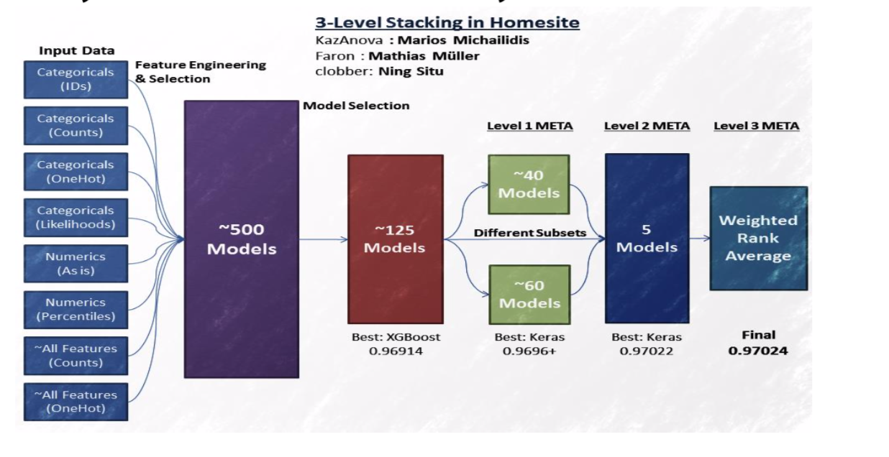

### How to train
- cannot use BP
- use stacking to link each model/node with target
- to extend to many levels, we can use KFold parameters
- No epochs - different connections instead

### first level Tips
1. Diversity based on algo
- 2-3 gradient boosted trees(xgboost, H2O, catboost)
- 2-3 Neural Net (keras, pyTorch)
- 1-2 ExtraTree/ Random Forest( sklearn)
- 1-2 Linear models as in Logistic/ridge regression, linearsvm(sklearn)
- 1-2 knn models(sklearn)
- 1 Factorization machine (libfm)
- 1 svm with nonlinear kernel if size/memory allows(sklearn)
- 1 svm with nonlinear kernel if size/memory allows(sklearn)
2. Diversity based on input data
- Categorical features: One hot, label encoding, target encoding, frequency.
- Numberical features: outliner, binning, derivatives, percentiles, scaling
- Interactions: col1 \*/+-col2, groupby, unsupervied
- For classification target, we can use regression models in middle level 

### Subquent level tips
1. Simpler(or shallower) algo
- gradient boosted tree with small depth(2 or 3)
- linear models with high reglarization
- Extra Trees
- Shallow network
- Knn with BrayCurtis Distance
- Brute forcing a seach for best linear weights based on cv
2. Feature engineering
- parwise differences between meta features
- row-wise statics like average or stds
- Standard feature selection techniques
- For evenry 7.5 models in previous level we add 1 in meta(empirical)
- Be mindful of target leakage


### Software
- StackNet (https://github.com/kaz-Anova/StackNet)
- Stacked ensembles from H20
- Xcessiv (https://github.com/reiinakano/xcessiv)


