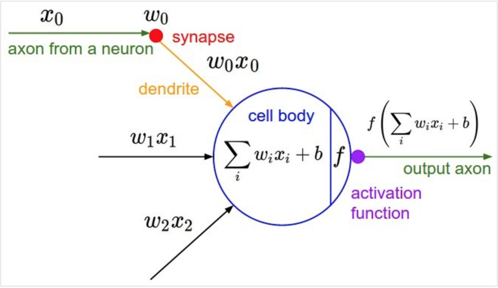
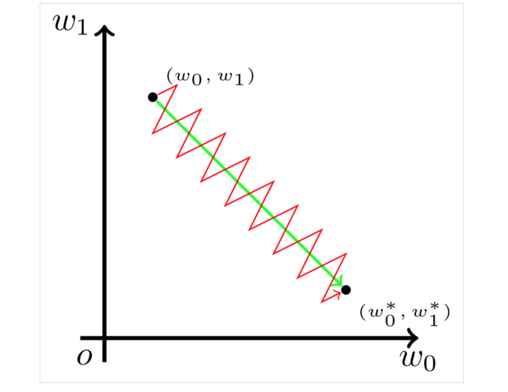

## Neuron

如图是神经网络中一个典型的神经元设计，它完全仿照人类大脑中神经元之间传递数据的模式设计。大脑中，神经元通过若干树突（dendrite）的突触（synapse），接受其他神经元的轴突（axon）或树突传递来的消息，而后经过处理再由轴突输出。

## 参数更新方向

深度学习一般的学习方法是反向传播。简单来说，就是通过链式法则，求解全局损失函数L(x)对于某一参数w的偏导数（梯度）；而后辅以学习率\eta,向梯度的反方向更新参数w

$$ w \leftarrow w - \eta\cdot\frac{\partial L}{\partial w} $$

考虑学习率$\eta$是全局设置的超参数，参数更新的核心步骤即是计算$\frac{\partial L}{\partial w}$ 再考虑到对于某个神经元来说，其输入与输出的关系是
$$f(x;w,b) = f(\sum_{i}w_i x_i + b)$$
根据链式法则，对于参数w_i来说
$$\frac{\partial L}{\partial w_i} = \frac{\partial L}{\partial f}\frac{\partial f}{\partial w_i} = x_i\cdot\frac{\partial L}{\partial f} $$

因此，参数的更新步骤变为

$$ w \leftarrow w - \eta x_i\cdot\frac{\partial L}{\partial f} $$

由于$w_i$是上一轮迭代的结果，此处可视为常数，而$\eta$是模型超参数，参数$w_i$的更新方向实际上由$x_i\cdot\frac{\partial L}{\partial f}$决定。又考虑到 $\frac{\partial L}{\partial f}$对于所有的$w_i$来说是常数，因此各个$w_i$更新方向之间的差异，完全由对应的输入值$x_i$ 的符号决定。

## 以零为中心的影响

至此，为了描述方便，我们以二维的情况为例。亦即，神经元描述为

$$f(x;w_1,w_2,b) = f(w_0x_0 + w_1x_1 + b)$$

假设对于参数 $w_0$,$w_1$的最优解$w_0^{\prime}$,$w_1^{\prime}$

\begin{equation}
\left\{ 
\begin{array}{lr}

& w_0 < w_0^{\prime} \\
& w_1 > w_1^{\prime}

\end{array}
\right.
\end{equation}

我们希望$w_0$适当增大，$w_1$适当减少，这里必然要求$x_0$ 和 $x_1$ 符号相反。
但在 Sigmoid 函数中，输出值恒为正。这也就是说，如果上一级神经元采用 Sigmoid 函数作为激活函数，**那么我们无法做到$x_0$和$x_1$符号相反**。此时，模型为了收敛，不得不向逆风前行的风助力帆船一样，走 Z 字形逼近最优解。

## Sigmid 

### 函数形式
$$\sigma(x;a) = \frac{1}{1+e^{-ax}}$$

### 导数

$$\sigma^{\prime} = \sigma(x)(1-\sigma(x))$$

### 性质
- Sigmoid neurons can saturate and lead to vanishing gradients.
- Not zero-centered.
- $e^{x}$is computationally expensive.

## Tanh

### 函数形式
$$tanh(x) = 2\sigma(2x) - 1 = \frac{e^x - e^{-x}}{e^x + e^{-x}}$$

### 导数

$$\tanh^{\prime} = 1-\tanh^{2}(x)$$

### 性质
- Zero-centered.
- $e^{x}$is computationally expensive.
- tanh can saturate and lead to vanishing gradients.

## Relu

### 函数形式
$$f(x) = max(0,x)$$

### 性质
- Fast to compute.
- Gradients do not vanish for 𝑥 > 0.
- Provides faster convergence in practice!
- Not zero-centered.
- Can die: if not activated, never updates!

## Relu

### 函数形式
$$f(x) = max(ax,x)$$

### 性质
- Will not die
- a != 1
- zero-centered

