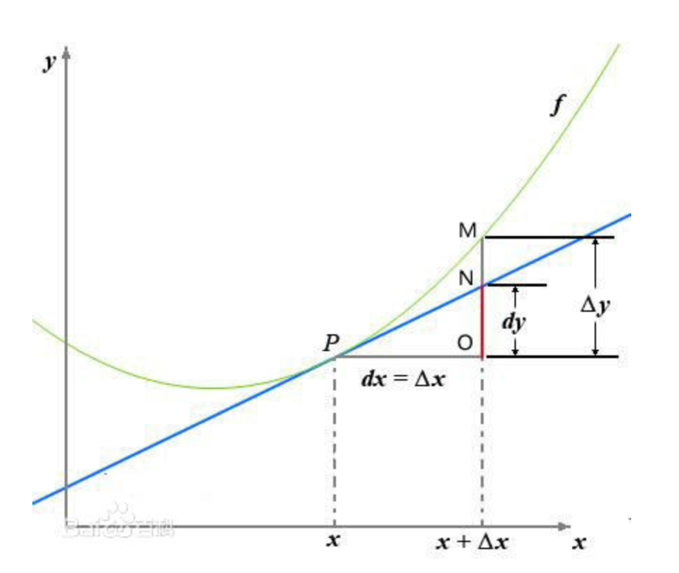

## 泰勒公式
定理：
设 n 是一个正整数。如果定义在一个包含 a 的区间上的函数 f 在 a 点处 n+1 次可导，那么对于这个区间上的任意 x，都有:

$$f(x) = f(a) + \frac{f^{\prime}(a)}{1!}(x-a) + \frac{f^{(2)}(a)}{2!}(x-a)^{2} + \cdots + \frac{f^{(n)}(a)}{n!}(x-a)^{n} + R_{n}(x)$$

## 导数

$$f^{\prime}(x_0) = \lim_{\vartriangle{x} \to 0 }{\frac{\vartriangle{y}}{\vartriangle{x}}} = \lim_{\vartriangle{x} \to 0 }\frac{f(x_0)+\vartriangle{x}) - f(x_0)}{\vartriangle{x}}$$

反映的是函数y=f(x)在某一点处沿x轴正方向的变化率。再强调一遍，是函数f(x)在x轴上某一点处沿着x轴正方向的变化率/变化趋势。直观地看，也就是在x轴上某一点处，如果$f^{\prime}(x)>0$，说明f(x)的函数值在x点沿x轴正方向是趋于增加的；如果$f^{\prime}(x)<0$，说明f(x)的函数值在x点沿x轴正方向是趋于减少的。

## 导数和偏导数

偏导数的定义如下:
$$\frac{\partial}{ \partial(x_j)}f(x_0,x_1,\cdots,x_n) = \lim_{\vartriangle{x} \to 0 }{\frac{\vartriangle{y}}{\vartriangle{x}}} = \lim_{\vartriangle{x} \to 0 }\frac{f(x_0,\cdots,x_j + \vartriangle{x}, \cdots , x_n) - f(x_0,\cdots,x_j, \cdots , x_n) }{\vartriangle{x}}$$

可以看到，导数与偏导数本质是一致的，都是当自变量的变化量趋于0时，函数值的变化量与自变量变化量比值的极限。直观地说，偏导数也就是函数在某一点上沿坐标轴正方向的的变化率。 区别在于： 

- 导数，指的是一元函数中，函数$y=f(x)$在某一点处沿x轴正方向的变化率； 
- 偏导数，指的是多元函数中，函数$y=f(x_1,x_2,…,x_n)$在某一点处沿某一坐标轴$(x_1,x_2,…,x_n)$正方向的变化率。 

## 导数与方向导数：

方向导数的定义如下：

$$\frac{\partial}{ \partial(x_l)}f(x_0,x_1,\cdots,x_n) = \lim_{\rho \to 0 }{\frac{\vartriangle{y}}{\rho}} = \lim_{\rho \to 0 }\frac{f(x_0 + \vartriangle{x_0},\cdots,x_j + \vartriangle{x_j}, \cdots , x_n+\vartriangle{x_n}) - f(x_0,\cdots,x_j, \cdots , x_n) }{\rho}$$

$$\rho = \sqrt{(\vartriangle{x_0})^2 + \cdots + (\vartriangle{x_j})^{2} + \cdots + (\vartriangle{x_n})^{2}}$$ 

在前面导数和偏导数的定义中，均是沿坐标轴正方向讨论函数的变化率。那么当我们讨论函数沿某一任意方向的变化率时，也就引出了方向导数的定义，即：某一点在某一趋近方向上的导数值。我们不仅要知道函数在坐标轴正方向上的变化率（即偏导数），而且还要设法求得函数在其他特定方向上的变化率。而方向导数就是函数在其他特定方向上的变化率

## 导数与梯度

梯度定义如下：函数在某一点的梯度是这样一个向量，它的方向与取得最大方向导数的方向一致，而它的模为方向导数的最大值。

$$gradf(x_0,x_1,\cdots,x_n) = (\frac{\partial}{\partial{x_0}},\frac{\partial}{\partial{x_j}},\frac{\partial}{\partial{x_n}})$$

梯度的提出只为回答一个问题： **函数在变量空间的某一点处，沿着哪一个方向有最大的变化率？**  

这里注意三点： 
- 梯度是一个向量，即有方向有大小； 
- 梯度的方向是最大方向导数的方向； 
- 梯度的值是最大方向导数的值。 

## 梯度下降法

既然在变量空间的某一点处，函数沿梯度方向具有最大的变化率，那么在优化目标函数的时候，自然是沿着负梯度方向去减小函数值，以此达到我们的优化目标。 如何沿着负梯度方向减小函数值呢？既然梯度是偏导数的集合，如下：
$$gradf(x_0,x_1,\cdots,x_n) = (\frac{\partial}{\partial{x_0}},\frac{\partial}{\partial{x_j}},\frac{\partial}{\partial{x_n}})$$

同时梯度和偏导数都是向量，那么参考向量运算法则，我们在每个变量轴上减小对应变量值即可，梯度下降法可以描述如下：

Repeat {
$$\begin{equation}\begin{split}
    & x_0 := x_0 -\alpha\frac{\partial}{\partial{x_0}} \\
    & \cdots \\
    & x_j := x_j -\alpha\frac{\partial}{\partial{x_j}} \\
    & \cdots \\
    & x_n := x_n -\alpha\frac{\partial}{\partial{x_n}} 
\end{split} \end{equation}$$   
}

