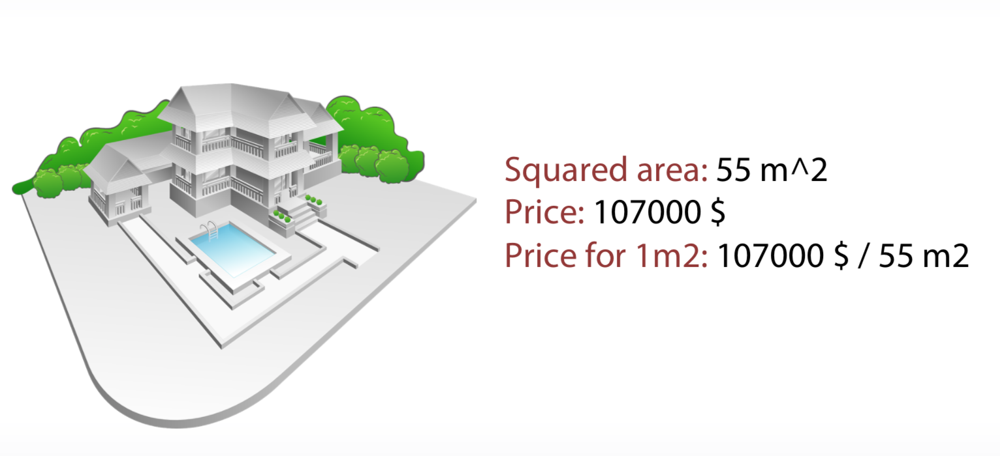
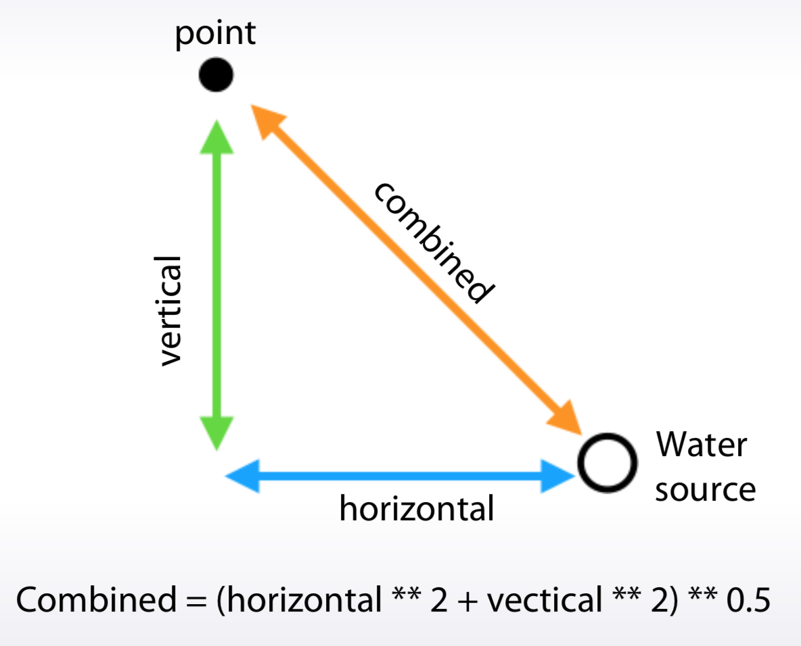
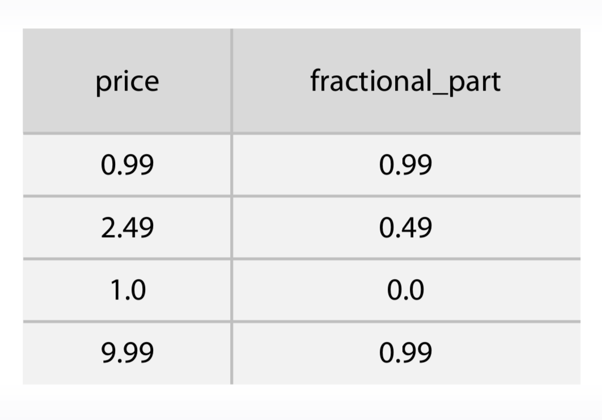
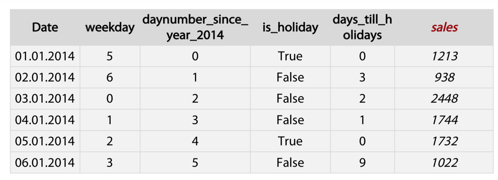
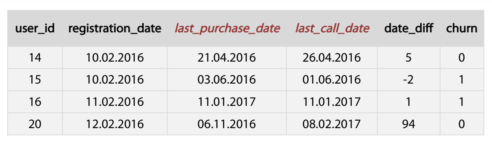
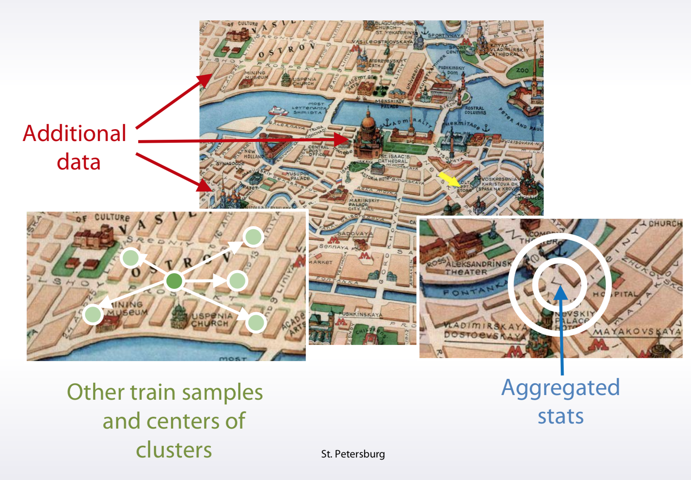
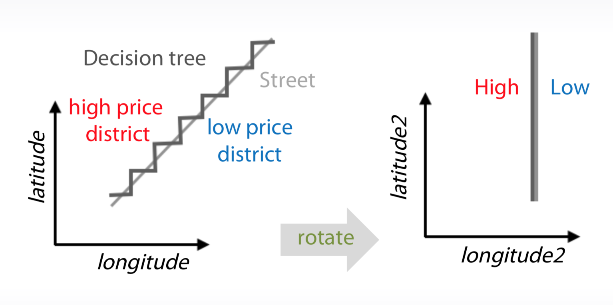
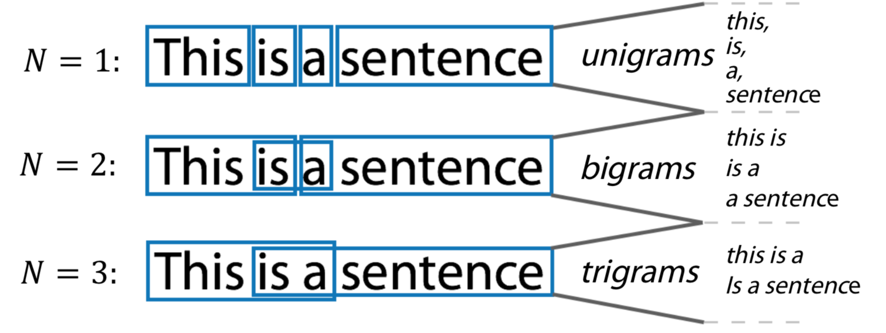
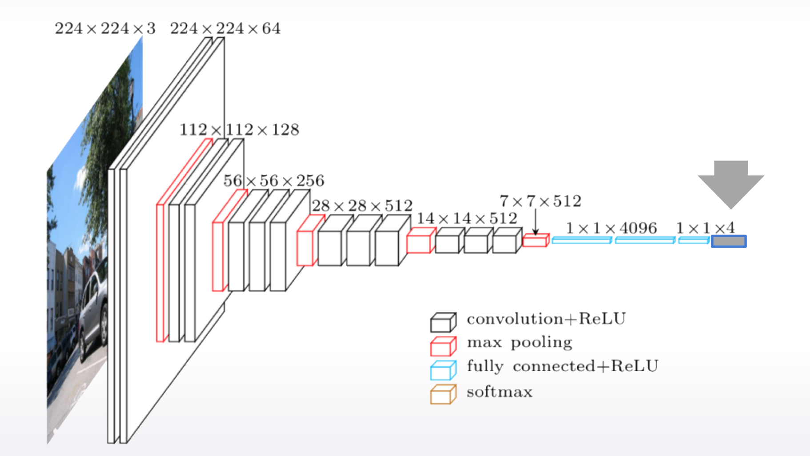
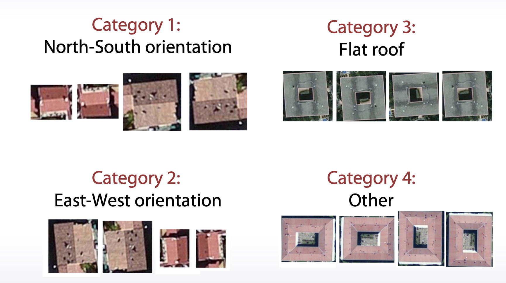

# Feature Preprocessing 

## Numeric feature

1. Tree-based models doesn't depend on scaling and Rank 
b. Non-tree-based models hugely depend on scaling and Rank

### scaling
1. To [0,1]
```python
sklearn.preprocessing.MinMaxScaler

x = (x-min()) / (x.max() - x.min())
``` 
2. To mean=0,std=1
```python
sklearn.preprocessing.StandardScaler
x = (x - x.mean()) / x.std()
```

### Rank
```python
from scipy.stats import rankdata

rankdata([0, 2, 3, 2])
# array([ 1. ,  2.5,  4. ,  2.5])
rankdata([0, 2, 3, 2], method='min')
# array([ 1,  2,  4,  2])
rankdata([0, 2, 3, 2], method='max')
# array([ 1,  3,  4,  3])
rankdata([0, 2, 3, 2], method='dense')
# array([ 1,  2,  3,  2])
rankdata([0, 2, 3, 2], method='ordinal')
# array([ 1,  2,  4,  3])
```

## Other
You can apply log transformation through your data, or there's another possibility. You can extract a square root of the data. Both these transformations can be useful because they drive too big values closer to the features' average value. Along with this, **the values near zero are becoming a bit more distinguishable**. Despite the simplicity, one of these transformations can improve your neural network's results significantly.
```Python
np.log(1+x)
np.sqrt(x+2/3)
```

### outlier
```python
UPPERBOUND,LOWERBOUND = np.percentile(x,[1,99])
y = np.clip(x, UPPERBOUND, LOWERBOUND)
```


### Feature generation
Sometimes, we can engineer these features using **prior knowledge and logic**. Sometimes we have to **dig into the data**, create and check hypothesis, and use this derived knowledge and our intuition to derive new features.

1. prior knowledge

It is useful to know that adding, multiplications, divisions, and other features interactions can be of help not only for linear models. For example, although gradient within decision tree is a very powerful model, it still experiences difficulties with approximation of multiplications and divisions. And adding size features explicitly can lead to a more robust model with less amount of trees.





This feature can help the model utilize the differences in people's perception of these prices. Also, we can find similar patterns in tasks which require distinguishing between a human and a robot.



2. EDA(Exploratory data analysis)

## Category feature

1. Label and Frequency encodings are often used for tree-
based models
2. One-hot encoding is often used for non-tree-based models
3. Interactions of categorical features can help linear models
and KNN


### Ordinal features
Values in ordinal features are sorted in some meaningful order
- Ticket class: 1,2,3 
- Driver’s license: A, B, C, D
- Education: kindergarden, school, undergraduate, bachelor, master, doctoral

1. Label encoding maps categories to numbers
```python
from sklearn import preprocessing
encoder = preprocessing.LabelEncoder()
encoder.fit(categorical_features)
```
2. Frequency encoding maps categories to their frequencies
```python
encoding = titanic.groupby(‘Embarked’).size() 
encoding = encoding/len(titanic) 
titanic["enc"] = titanic.Embarked.map(encoding)
```


## Datetime
1. Periodicity
Day number in week, month, season, year second, minute, hour.
2. Time since
- Row-independent moment
For example: since 00:00:00 UTC, 1 January 1970;
- Row-dependent important moment
Number of days left until next holidays / time passed after last holiday.

3. Difference between dates
- datetime_feature_1 - datetime_feature_2


## Coordinates
1. Interesting places from train/test data or additional data
Generally, you can calculate distances to important points on the map. You can extract interesting points on the map from your trained test data.
2. Centers of clusters
3. Aggregated statistics
use coordinates is to calculate aggregated statistics for objects surrounding area.

4. If you train decision trees from them, you can add slightly rotated coordinates is new features. And this will help a model make more precise selections on the map.



## Missing Data
### Fillna approaches
1. -999, -1, etc
2. mean, median
3. Reconstruct value
    - we should be very careful with replacing missing values before our feature generation
4. It can be beneficial to change the missing values or categories which present in the test data but do not present in the train data. The intention for doing so appeals to the fact that the model which didn't have that category in the train data will eventually treat it **randomly**.

### Isnull feature

|||
|:--|:--|
|0.1|False|
|0.2|False|
|NaN|True|


# Feature extraction
## Texts
1. Preprocessing
    - Lowercase, stemming, lemmarization, stopwords 
    ```
    Lowercase: Very, very -> very,very 
    lemmarization: I had a car -> I have a car
    stopwords: sklearn.feature_extraction.text.CountVectorizer(max_df)
    ```
2. Bag of words
```
# Design the Vocabulary
# Create Document Vectors

"it was the worst of times" = [1, 1, 1, 0, 1, 1, 1, 0, 0, 0]
"it was the age of wisdom" = [1, 1, 1, 0, 1, 0, 0, 1, 1, 0]
"it was the age of foolishness" = [1, 1, 1, 0, 1, 0, 0, 1, 0, 1]
```
    - Huge vectors
    - Ngrams can help to use local context
    
    ```python3
    from sklearn.feature_extraction.text import CountVectorizer
    # Ngram_range, analyzer
    ```
    - TF-IDF can be of use as postprocessing
    > 如果某个词或短语在一篇文章中出现的频率TF高，并且在其他文章中很少出现，则认为此词或者短语具有很好的类别区分能力，适合用来分类。TFIDF实际上是：TF * IDF，TF词频(Term Frequency)，IDF反文档频率(Inverse Document Frequency)。TF表示词条在文档d中出现的频率（另一说：TF词频(Term Frequency)指的是某一个给定的词语在该文件中出现的次数）。IDF的主要思想是：如果包含词条t的文档越少，也就是n越小，IDF越大（见后续公式），则说明词条t具有很好的类别区分能力。
    ```python
    ## Term frequency
    tf = 1 / x.sum(axis=1) [:,None]
    x = x * tf
    ## Inverse Document Frequency
    idf = np.log(x.shape[0] / (x > 0).sum(0)) x = x * idf

    from sklearn.feature_extraction.text import TfidfVectorizer
    ```
3. Word2vec
    - Relatively small vectors
    - Pretrained models

## Images
- Features can be extracted from different layers
- Careful choosing of pretrained network can help
- Finetuning allows to refine pretrained models

- Data augmentation can improve the model
