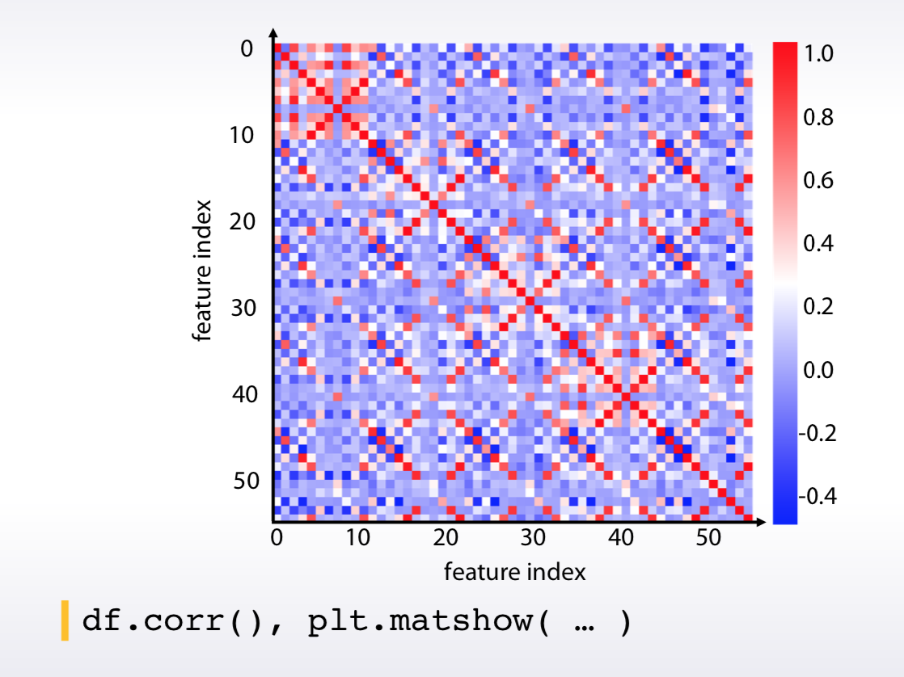
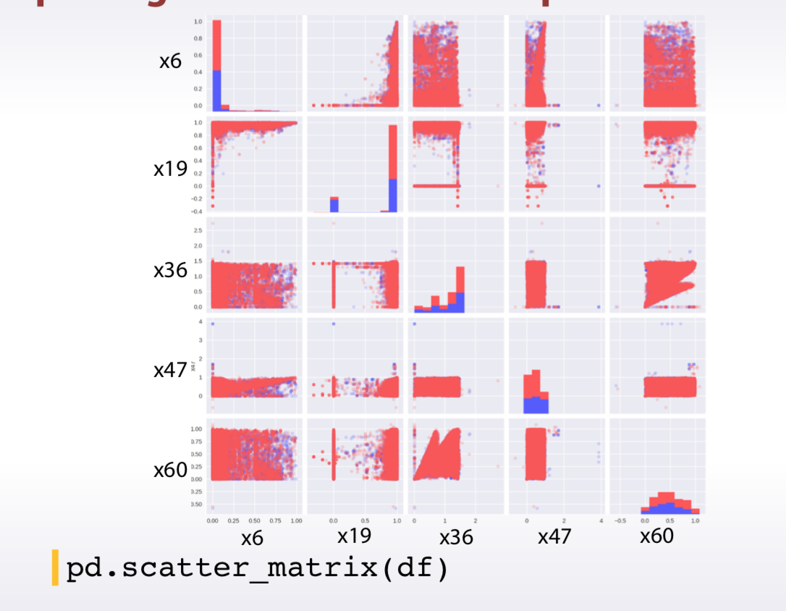
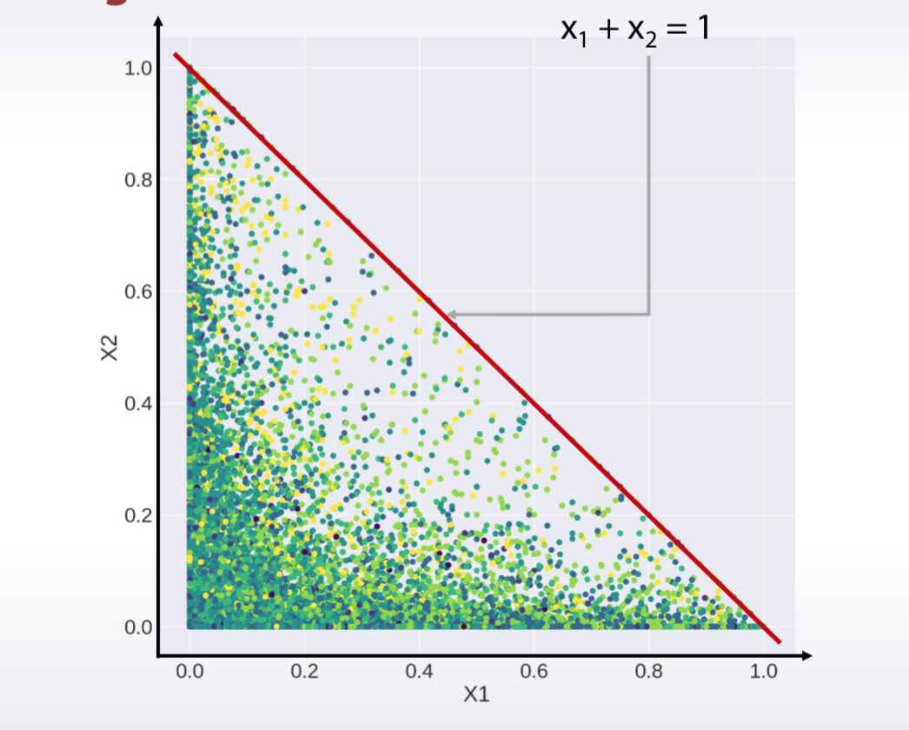
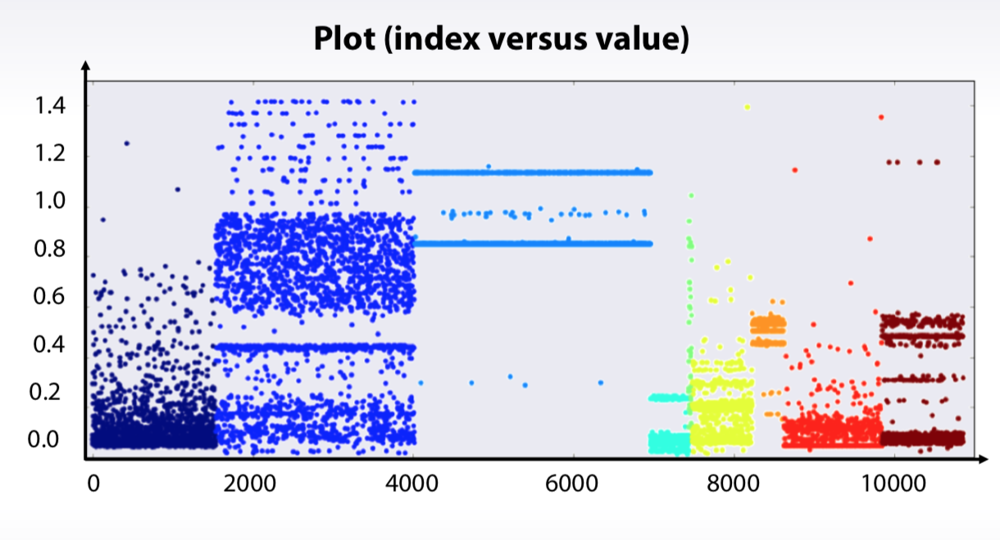

# Exploratory data analysis

## What and Why?
- Better understand the data
- Build an intuition about the data
- Generate hypothesizes
- Find insights


## Building intuition about the data
1. Get domain knowledge
– It helps to deeper understand the problem
2. Check if the data is intuitive
– And agrees with domain knowledge
3. Understand how the data was generated
- As it is crucial to set up a proper validation
---
4. Explore individual features
5. Explore pairs and groups
---
6. Clean features up
---
7. Check for leaks!


## Exploring anonymized data
Two things to do with anonymized features:
1. Try to decode the features
- Guess the true meaning of the feature
2. Guess the feature types
- Each type needs its own preprocessing


## Visualization

> EDA is an art And visualizations are our art tools !

### Tools for individual features exploration

1. Histograms:
```python
plt.hist(x)
```
2. Plot (index versus value):
```python
plt.plot(x, '.')
```
3. Statistics:
```python
df.describe()
x.mean()
x.var()
```
4. Other tools:
```python
x.value_counts()
x.isnull()
```

### Explore feature relations 
1. Pairs
− Scatter plot, scatter matrix
− Corrplot
```python
plt.scatter(x1, x2)
pd.scatter_matrix(df)
df.corr()
plt.matshow()
```
2. Groups
− Corrplot + clustering
− Plot (index vs feature statistics)
```
df.mean().plot(style=’.’)
df.mean().sort_values().plot(style=’.’)
```

### Examples






### Dataset cleaning

1. Constant features
```python
train.nunique(axis=1) == 1
```
2. Duplicated features
```python
traintest.T.drop_duplicates()

for f in categorical_feats: 
    traintest[f] = raintest[f].factorize()
traintest.T.drop_duplicates()
```
3. Duplicated rows
- Check if same rows have same label
- Find duplicated rows, understand why they are duplicated
4. Check if dataset is shuffled


## Validation
1. Validation helps us evaluate a quality of the model
2. Validation helps us select the model which will perform best on the unseen data
3. Underfitting refers to not capturing enough patterns in the data
4. Generally, overfitting refers to
    - capturing noize
    - capturing patterns which do not generalize to test data
5. In competitions, overfitting refers to
    - low model’s quality on test data, which was unexpected due to validation scores
6. There are three main validation strategies:
    1. Holdout
    > sklearn.model_selection.ShuffleSplit
    - Split train data into two parts: partA and partB.
    - Fit the model on partA, predict for partB.
    - Use predictions for partB for estimating model quality. Find such hyper-parameters, that quality on partB is maximized.
    2. KFold 
    > sklearn.model_selection.Kfold
    - Split train data into K folds.
    - Iterate though each fold: retrain the model on all folds except current fold, predict for the current fold.
    - Use the predictions to calculate quality on each fold. Find such hyper-parameters, that quality on each fold is maximized. You can also estimate mean and variance of the loss. This is very helpful in order to understand significance of improvement.
    3. LOO
    > sklearn.model_selection.LeaveOneOut
    - Iterate over samples: retrain the model on all samples except current sample, predict for the current sample. You will need to retrain the model N times (if N is the number of samples in the dataset).
    - In the end you will get LOO predictions for every sample in the trainset and can calculate loss.
    - Notice, that these are validation schemes are supposed to be used to estimate quality of the model. When you found the right hyper-parameters and want to get test predictions don't forget to retrain your model using all training data.
    4. Stratification preserve the same target distribution over different folds


## Data split 
1. In most cases data is split by:
- Rownumber
- Time
- Id
2. Logic of feature generation depends on the data splitting strategy
Set up your validation to mimic the train/test split of the competition
3. Set up your validation to mimic the train/test split of the competition 

### Validation problems

1. If we have big dispersion of scores on validation stage, we should do extensive validation
    - Average scores from different KFold splits
    - Tune model on one split, evaluate score on the other
2. If submission’s score do not match local validation score,
we should
    - Check if we have too little data in public LB
    - Check if we overfitted
    - Check if we chose correct splitting strategy
    - Check if train/test have different distibutions
3. Expect LB shuffle because of
    - Randomness
    – Little amount of data
    – Different public/private distributions


## Data leakage

- Split should be done on time.
    - In real life we don’t have information from future
    - In competitions first thing to look: train/public/private
split, is it on time?
- Even when split by time, features may contain information about future.
    - User history in CTR tasks
    - Weather